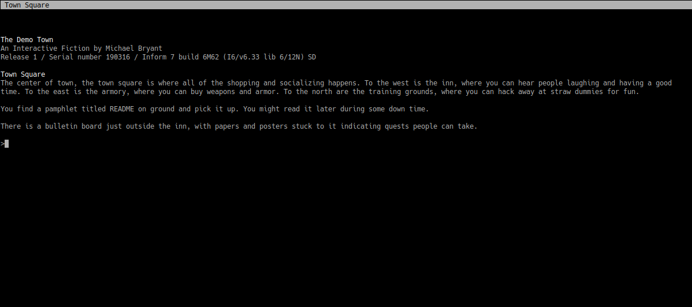
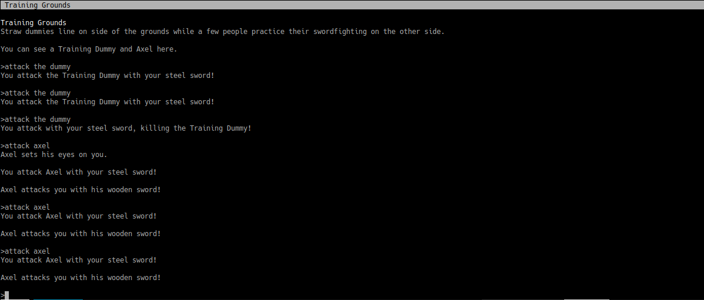
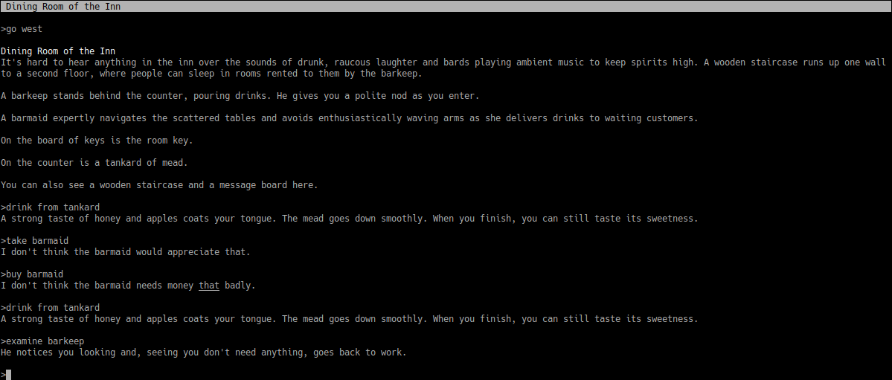

# Town Adventure

A text adventure game (demo) made for a video game design class.

## Description

The entire text adventure takes place in a single town (so far). There's still
a lot available to do, though, like:

- Marvel at how empty the job board is.
- Buy weapons and armor and wonder how you're supposed to make more money.
- Fight a dummy or a man made of straw.
- Rent a room at the Inn and try to sneak out with the key.
    - Bonus points for breaking the chest in the room!
- Insult the barmaid by attempting to buy her.
- Drink some mead.
- Drink some more.

In all seriousness, this project started out as a way to build the mechanics
necessary for an *actually* good game, since Inform 7 doesn't come with those
mechanics built in. People tell me they've had fun playing this demo, though
I think some (most?) of that fun came from trying to break it.

## Screenshots

Retro graphics are all the rage, right? Well this is about as retro as it gets!

## Playthrough

This video is for an older version of the game and so does not include some of
the features found in the most recent version. Still, it's enough if you want
to get an idea for what the game is like.

